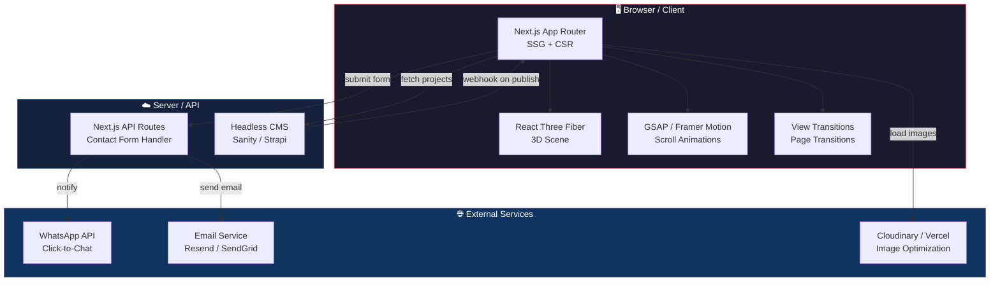
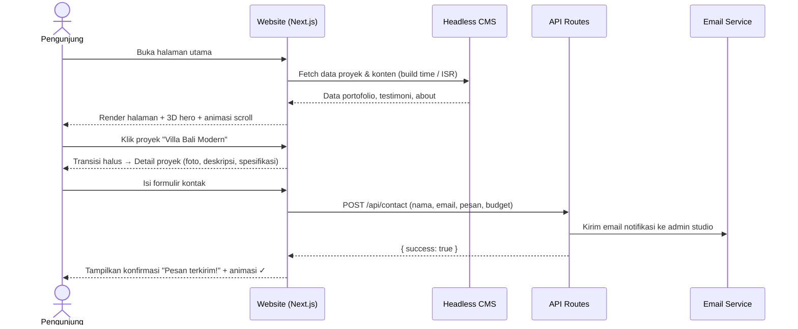
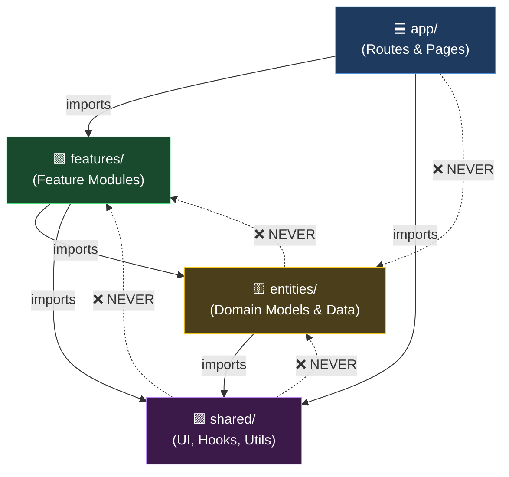

# PRD — HaloArsitek

## 1. **Overview**
HaloArsitek adalah **website portofolio & landing page** untuk studio arsitektur yang dirancang dengan pendekatan **minimalis, immersive, dan premium**. Website ini menggabungkan estetika editorial gelap (*dark mode*) dengan elemen **animasi 3D interaktif** menggunakan **Three.js** — menciptakan pengalaman visual yang menyerupai galeri arsitektur digital. Desainnya terinspirasi dari [dhaniesal.com](https://www.dhaniesal.com/) — sebuah situs kreatif dengan transisi halus, tipografi bersih, dan hero section fullscreen.

**Masalah yang diselesaikan:**
Banyak studio arsitektur di Indonesia masih mengandalkan portofolio konvensional (PDF, media sosial saja) yang tidak memberikan kesan profesional dan premium. Calon klien kesulitan melihat kualitas desain secara menyeluruh, dan tidak ada *touchpoint* digital yang merepresentasikan identitas studio secara kuat. Website yang ada umumnya statis dan tidak memiliki elemen interaktif yang mampu memikat pengunjung sejak pandangan pertama.

**Tujuan Utama:**
Menyediakan website portofolio arsitektur yang **stunning, immersive, dan cepat** — pengunjung langsung disambut oleh visualisasi 3D bangunan/model arsitektur yang interaktif, galeri proyek ditampilkan dengan transisi sinematik, dan informasi studio disajikan dengan layout editorial minimalis. Website menjadi **alat presentasi digital utama** yang meningkatkan kredibilitas dan konversi klien baru.

**Target Pengguna:**
- **Pengunjung / Calon Klien:** melihat portofolio proyek, memahami keahlian studio, dan menghubungi tim arsitek.
- **Pemilik Studio (Admin):** mengelola konten portofolio, testimoni, dan informasi perusahaan.

---

## 2. **Requirements**

**Kebutuhan Fungsional:**
- **Hero Section 3D Interaktif:** menampilkan model 3D arsitektur (rumah, gedung, atau objek geometris abstrak) menggunakan **Three.js / React Three Fiber** yang dapat diputar, di-zoom, atau beranimasi otomatis. Model bereaksi terhadap gerakan mouse (*parallax / orbit*).
- **Navigasi Minimalis Fixed:** header transparan dengan logo dan menu hamburger/overlay — terinspirasi dari navigasi sederhana dhaniesal.com. Menu muncul sebagai *fullscreen overlay* dengan animasi masuk yang halus.
- **Galeri Portofolio Sinematik:** showcase proyek arsitektur dengan tata letak *masonry / grid* atau *fullscreen slider* (mirip Swiper di dhaniesal.com). Setiap kartu proyek memiliki hover effect yang menampilkan judul, lokasi, dan tahun.
- **Halaman Detail Proyek:** setiap proyek memiliki halaman detail yang menampilkan galeri foto besar, deskripsi proyek, spesifikasi (luas, lokasi, tahun), dan konsep desain.
- **Section "Tentang Studio":** menampilkan filosofi studio, tim arsitek (foto + bio singkat), dan pencapaian/penghargaan.
- **Section Layanan:** daftar layanan studio (desain arsitektur, interior, landscape, konsultasi) dengan ikon/ilustrasi 3D kecil.
- **Testimoni Klien:** slider/carousel testimoni klien sebelumnya dengan animasi fade atau parallax.
- **Section Kontak & CTA:** formulir kontak terintegrasi + peta lokasi (embed) + link WhatsApp langsung. CTA (*Call to Action*) yang kuat: "Konsultasi Gratis" atau "Mulai Proyek Anda".
- **Animasi Scroll-Driven:** elemen-elemen muncul secara progresif (*reveal on scroll*) menggunakan **GSAP / Intersection Observer** — teks melayang masuk, gambar fade-in, counter angka berjalan.
- **Transisi Halaman Halus:** menggunakan **View Transitions API** atau library seperti **Barba.js** agar perpindahan antar halaman terasa sinematik, bukan reload biasa.
- **Responsif & Mobile-First:** semua section dioptimalkan untuk tampilan mobile. 3D hero section memiliki fallback animasi CSS ringan untuk perangkat low-end.
- **SEO-Friendly:** setiap halaman memiliki meta title, description, dan structured data (LocalBusiness schema) untuk meningkatkan visibilitas di Google.

**Kebutuhan Non-Fungsional:**
- **Performa:** First Contentful Paint (FCP) di bawah 2 detik. 3D asset di-lazy-load agar tidak memblokir rendering awal.
- **Aksesibilitas:** kontras warna memenuhi WCAG AA, navigasi keyboard-friendly, dan alt-text pada semua gambar.
- **Kompatibilitas Browser:** mendukung Chrome, Firefox, Safari, dan Edge versi terbaru. WebGL fallback untuk browser yang tidak mendukung.
- **Dark Mode Native:** desain utama menggunakan palet gelap (hitam/abu gelap) dengan aksen warna hangat. Opsional toggle ke light mode.

---

## 3. **Core Features**

- **3D Architectural Hero:** model Three.js interaktif sebagai centerpiece halaman utama — bisa berupa wireframe bangunan, denah 3D yang berputar, atau partikel geometris yang membentuk silhouette rumah.
- **Portofolio Showcase:** galeri proyek dengan layout sinematik, filter kategori (residensial, komersial, interior), dan detail page per proyek.
- **Smooth Page Transitions:** transisi antar halaman menggunakan View Transitions API atau Barba.js, menciptakan pengalaman *app-like*.
- **Scroll Storytelling:** setiap section bercerita secara progresif saat di-scroll — angka statistik berjalan, gambar parallax, teks fade-in.
- **Contact Conversion:** formulir kontak yang terhubung ke email/WhatsApp, ditampilkan dengan desain premium dan animasi submit.
- **Admin CMS (Fase 2):** panel admin sederhana untuk mengelola proyek portofolio, testimoni, dan konten halaman.

---

## 4. **User Flow**

**a. Alur Pengunjung (Visitor Flow):**
1. Pengunjung membuka website → disambut **hero section fullscreen** dengan animasi 3D model arsitektur dan tagline studio.
2. Scroll ke bawah → section **"Tentang Kami"** muncul dengan animasi reveal. Filosofi studio dan angka statistik (proyek selesai, tahun berdiri) ditampilkan.
3. Scroll lanjut → **portofolio proyek** tampil dalam grid/masonry. Hover pada kartu menampilkan preview.
4. Klik proyek → masuk **halaman detail** dengan transisi halus. Galeri foto besar, deskripsi, dan spesifikasi proyek ditampilkan.
5. Kembali ke halaman utama → scroll ke section **layanan** (arsitektur, interior, landscape).
6. Section **testimoni** menampilkan kutipan klien sebelumnya.
7. Di bagian bawah → **formulir kontak** + tombol WhatsApp + peta lokasi.
8. Pengunjung mengisi form atau klik WhatsApp → inquiry terkirim.

**b. Alur Admin (Content Management — Fase 2):**
1. Admin login ke dashboard CMS.
2. Tambah/edit proyek portofolio: upload foto, isi judul, deskripsi, kategori, tahun, dan lokasi.
3. Kelola testimoni: tambah kutipan klien, nama, dan perusahaan.
4. Edit konten halaman: ubah tagline hero, deskripsi about, dan informasi kontak.
5. Publish perubahan → website terupdate secara real-time.

---

## 5. **Architecture**

Sistem menggunakan arsitektur **JAMstack** modern. Frontend berupa aplikasi **Next.js (App Router)** yang di-deploy ke **Vercel** dengan rendering hibrida (SSG untuk halaman portofolio, SSR untuk halaman dinamis). Animasi 3D dihandle di client-side menggunakan **React Three Fiber** (wrapper React untuk Three.js). Konten dinamis disimpan di **headless CMS** (Sanity/Strapi) atau database sederhana. Gambar dioptimasi otomatis melalui **Vercel Image Optimization** atau Cloudinary.





---

## 6. **Sitemap & Halaman**

Website terdiri dari halaman-halaman berikut:

| No | Halaman | Route | Deskripsi |
|----|---------|-------|-----------|
| 1 | **Home** | `/` | Hero 3D, about preview, portofolio highlight, layanan, testimoni, CTA |
| 2 | **Portofolio** | `/portofolio` | Galeri seluruh proyek dengan filter kategori |
| 3 | **Detail Proyek** | `/portofolio/[slug]` | Galeri foto, deskripsi, spesifikasi proyek individual |
| 4 | **Tentang Kami** | `/tentang` | Filosofi, tim, sejarah, pencapaian studio |
| 5 | **Layanan** | `/layanan` | Daftar layanan dengan detail dan ilustrasi |
| 6 | **Kontak** | `/kontak` | Formulir kontak, peta, WhatsApp, info alamat |

---

## 7. **Design System & Visual Direction**

Desain terinspirasi dari estetika [dhaniesal.com](https://www.dhaniesal.com/) — dark, minimalis, dan sinematik — disesuaikan untuk konteks studio arsitektur.

### Color Palette
```
Background Utama   : #0A0A0A (Near Black)
Background Sekunder: #141414 (Dark Charcoal)
Surface / Card     : #1C1C1E (Elevated Dark)
Teks Primer        : #F5F5F5 (Off-White)
Teks Sekunder      : #8A8A8E (Muted Gray)
Aksen Utama        : #C8A97E (Warm Gold — premium, arsitektural)
Aksen Hover        : #E8C89E (Light Gold)
Border / Divider   : #2C2C2E (Subtle Dark)
```

### Typography
```
Heading    : "Playfair Display" (serif, editorial, elegan)
Body       : "Inter" (sans-serif, clean, mudah dibaca)
Accent/Nav : "Outfit" (sans-serif, modern, geometric)
Monospace  : "JetBrains Mono" (untuk label teknis / spesifikasi)
```

### Spacing & Layout
- **Grid:** 12-column grid, max-width 1440px, padding horizontal 48px (desktop), 20px (mobile)
- **Section gap:** 120px antar section (desktop), 64px (mobile)
- **Border radius:** 0px untuk elemen besar (editorial/sharp), 8px untuk card/button kecil
- **Gambar:** aspect ratio 16:9 (landscape), 3:4 (portrait), tanpa border radius (fullbleed)

### Animasi & Interaksi
- **3D Hero:** model wireframe arsitektur berputar pelan, bereaksi terhadap posisi mouse (orbit ringan). Partikel atau grid geometris sebagai background.
- **Scroll Reveal:** elemen teks muncul dari bawah (translateY + opacity), gambar fade-in dari samping. Stagger 100ms antar elemen.
- **Page Transitions:** crossfade + slide halus antar halaman (300–500ms). Menggunakan View Transitions API atau Barba.js.
- **Hover Effects:** gambar proyek zoom-in halus (scale 1.05) + overlay gradient gelap + judul proyek muncul.
- **Cursor Custom (opsional):** cursor bulat kecil yang membesar saat hover elemen interaktif.
- **Loading Screen:** animasi logo atau progress bar minimalis saat 3D asset pertama kali dimuat.

---

## 8. **Tech Stack**

Stack dipilih agar pengembangan cepat, performa tinggi, dan mendukung animasi 3D yang berat tanpa mengorbankan SEO:

- **Framework Web:** **Next.js 15 (App Router)** — SSG/ISR untuk halaman portofolio (SEO optimal), CSR untuk komponen 3D interaktif. File-based routing dengan layout nesting.
- **3D Engine:** **React Three Fiber** + **@react-three/drei** — wrapper deklaratif Three.js untuk React. Mendukung model GLTF/GLB, lighting, post-processing, dan kontrol orbit.
- **Animasi:** **GSAP (GreenSock)** + **ScrollTrigger** — animasi scroll-driven, timeline sequencing, dan morphing. Alternatif: **Framer Motion** untuk animasi komponen React.
- **Styling:** **Tailwind CSS v4** + **CSS custom properties** — utility-first untuk rapid UI, custom properties untuk design tokens (warna, spacing).
- **UI Components:** **shadcn/ui** — komponen yang bisa dikustom penuh, terintegrasi dengan Tailwind.
- **Page Transitions:** **View Transitions API** (native browser) dengan fallback **Barba.js** untuk browser yang belum support.
- **Headless CMS:** **Sanity** — real-time content editing, portable text, image pipeline bawaan. Alternatif: Strapi (self-hosted).
- **Form Handling:** **React Hook Form** + **Zod** — validasi form di client. API route Next.js untuk kirim email via **Resend** atau **SendGrid**.
- **Image Optimization:** **next/image** + **Cloudinary** — lazy loading, format WebP/AVIF otomatis, responsive srcset.
- **3D Model:** format **GLTF/GLB** yang dioptimasi via **gltf-pipeline** atau **Draco compression**. Fallback gambar statis untuk perangkat tanpa WebGL.
- **Deployment:** **Vercel** — edge network, automatic CI/CD dari GitHub, serverless functions untuk API routes.
---

## 9. **Project Structure & Architecture Patterns**

Struktur project mengadopsi **Feature-Sliced Design (FSD)** yang diadaptasi untuk **Next.js App Router** — memisahkan kode berdasarkan *feature domain* dan *layer responsibility*, bukan hanya tipe file. Pattern ini memastikan **scalability**, **maintainability**, dan **clear boundaries** antar modul seiring bertambahnya fitur.

### 9.1 Folder Structure

```
halo-arsitek/
├── .github/                          # CI/CD, PR templates
│   └── workflows/
│       └── ci.yml                    # Lint, test, build, Lighthouse CI
│
├── public/                           # Static assets (served as-is)
│   ├── fonts/                        # Self-hosted fonts (woff2)
│   ├── models/                       # 3D GLTF/GLB models (Draco-compressed)
│   ├── images/                       # Static images (OG images, favicons)
│   ├── robots.txt
│   └── sitemap.xml                   # Auto-generated by next-sitemap
│
├── src/
│   ├── app/                          # ── NEXT.JS APP ROUTER (Routes) ──
│   │   ├── layout.tsx                # Root layout: fonts, metadata, providers
│   │   ├── page.tsx                  # Home page (thin: compose widgets)
│   │   ├── loading.tsx               # Global loading fallback
│   │   ├── not-found.tsx             # Custom 404
│   │   ├── error.tsx                 # Global error boundary
│   │   ├── globals.css               # Tailwind directives + CSS custom props
│   │   │
│   │   ├── (marketing)/              # Route group: public pages
│   │   │   ├── portofolio/
│   │   │   │   ├── page.tsx          # Portfolio listing
│   │   │   │   └── [slug]/
│   │   │   │       └── page.tsx      # Project detail (SSG with generateStaticParams)
│   │   │   ├── tentang/
│   │   │   │   └── page.tsx          # About page
│   │   │   ├── layanan/
│   │   │   │   └── page.tsx          # Services page
│   │   │   └── kontak/
│   │   │       └── page.tsx          # Contact page
│   │   │
│   │   └── api/                      # API Route Handlers
│   │       ├── contact/
│   │       │   └── route.ts          # POST: handle contact form → email
│   │       └── revalidate/
│   │           └── route.ts          # POST: webhook from CMS for ISR
│   │
│   ├── features/                     # ── FEATURE MODULES (Business Logic) ──
│   │   │                             # Each feature is self-contained
│   │   ├── hero/
│   │   │   ├── components/
│   │   │   │   ├── hero-section.tsx           # Main hero composition
│   │   │   │   ├── hero-scene.tsx             # Three.js 3D canvas
│   │   │   │   ├── hero-tagline.tsx           # Animated tagline text
│   │   │   │   └── scroll-indicator.tsx       # Scroll down indicator
│   │   │   ├── hooks/
│   │   │   │   └── use-hero-animation.ts      # GSAP timeline for hero
│   │   │   └── index.ts                       # Public barrel export
│   │   │
│   │   ├── portfolio/
│   │   │   ├── components/
│   │   │   │   ├── portfolio-grid.tsx         # Masonry/grid layout
│   │   │   │   ├── portfolio-card.tsx         # Single project card + hover
│   │   │   │   ├── portfolio-filter.tsx       # Category filter tabs
│   │   │   │   ├── project-gallery.tsx        # Detail page image gallery
│   │   │   │   └── project-specs.tsx          # Detail page specifications
│   │   │   ├── hooks/
│   │   │   │   └── use-portfolio-filter.ts    # Filter state management
│   │   │   ├── types/
│   │   │   │   └── portfolio.types.ts         # Project, Category interfaces
│   │   │   └── index.ts
│   │   │
│   │   ├── about/
│   │   │   ├── components/
│   │   │   │   ├── about-section.tsx          # About preview (home)
│   │   │   │   ├── stats-counter.tsx          # Animated number counters
│   │   │   │   ├── team-grid.tsx              # Team member grid
│   │   │   │   └── team-card.tsx              # Individual team card
│   │   │   └── index.ts
│   │   │
│   │   ├── services/
│   │   │   ├── components/
│   │   │   │   ├── services-section.tsx       # Services overview
│   │   │   │   └── service-card.tsx           # Individual service card
│   │   │   └── index.ts
│   │   │
│   │   ├── testimonials/
│   │   │   ├── components/
│   │   │   │   ├── testimonials-slider.tsx    # Swiper/slider carousel
│   │   │   │   └── testimonial-card.tsx       # Single testimonial
│   │   │   └── index.ts
│   │   │
│   │   ├── contact/
│   │   │   ├── components/
│   │   │   │   ├── contact-section.tsx        # CTA + contact form
│   │   │   │   ├── contact-form.tsx           # React Hook Form
│   │   │   │   └── map-embed.tsx              # Google Maps embed
│   │   │   ├── actions/
│   │   │   │   └── submit-contact.ts          # Server Action: send email
│   │   │   ├── schemas/
│   │   │   │   └── contact.schema.ts          # Zod validation schema
│   │   │   └── index.ts
│   │   │
│   │   └── navigation/
│   │       ├── components/
│   │       │   ├── navbar.tsx                 # Fixed transparent header
│   │       │   ├── menu-overlay.tsx           # Fullscreen menu overlay
│   │       │   ├── footer.tsx                 # Site footer
│   │       │   └── breadcrumb.tsx             # Breadcrumb navigation
│   │       └── index.ts
│   │
│   ├── entities/                     # ── DOMAIN ENTITIES (Data Models) ──
│   │   │                             # Shared data types & fetchers
│   │   ├── project/
│   │   │   ├── model/
│   │   │   │   └── project.ts                # Project interface & types
│   │   │   ├── api/
│   │   │   │   ├── get-projects.ts            # Fetch all projects from CMS
│   │   │   │   ├── get-project-by-slug.ts     # Fetch single project
│   │   │   │   └── get-project-categories.ts  # Fetch categories
│   │   │   └── index.ts
│   │   │
│   │   ├── testimonial/
│   │   │   ├── model/
│   │   │   │   └── testimonial.ts
│   │   │   ├── api/
│   │   │   │   └── get-testimonials.ts
│   │   │   └── index.ts
│   │   │
│   │   ├── team-member/
│   │   │   ├── model/
│   │   │   │   └── team-member.ts
│   │   │   ├── api/
│   │   │   │   └── get-team-members.ts
│   │   │   └── index.ts
│   │   │
│   │   └── service/
│   │       ├── model/
│   │       │   └── service.ts
│   │       ├── api/
│   │       │   └── get-services.ts
│   │       └── index.ts
│   │
│   ├── shared/                       # ── SHARED LAYER (Reusable) ──
│   │   │                             # Zero business logic, pure utilities
│   │   ├── ui/                       # Presentational components (shadcn/ui + custom)
│   │   │   ├── button.tsx
│   │   │   ├── card.tsx
│   │   │   ├── input.tsx
│   │   │   ├── textarea.tsx
│   │   │   ├── badge.tsx
│   │   │   ├── separator.tsx
│   │   │   ├── skeleton.tsx
│   │   │   ├── section-heading.tsx            # Reusable section title + subtitle
│   │   │   └── animated-counter.tsx           # Reusable number counter
│   │   │
│   │   ├── three/                    # Three.js shared utilities
│   │   │   ├── canvas-wrapper.tsx             # R3F Canvas with Suspense + fallback
│   │   │   ├── camera-rig.tsx                 # Camera controller (mouse react)
│   │   │   ├── environment-setup.tsx          # Lighting + environment
│   │   │   └── performance-monitor.tsx        # GPU detection + LOD switching
│   │   │
│   │   ├── animations/               # Animation utilities
│   │   │   ├── scroll-reveal.tsx              # Wrapper: fade-in on scroll
│   │   │   ├── stagger-children.tsx           # Wrapper: staggered entrance
│   │   │   ├── text-reveal.tsx                # Character-by-character reveal
│   │   │   ├── parallax-layer.tsx             # Parallax scroll wrapper
│   │   │   └── use-gsap-scroll.ts             # GSAP ScrollTrigger hook
│   │   │
│   │   ├── hooks/                    # Shared custom hooks
│   │   │   ├── use-media-query.ts             # Responsive breakpoint detection
│   │   │   ├── use-intersection.ts            # IntersectionObserver hook
│   │   │   ├── use-webgl-support.ts           # WebGL capability detection
│   │   │   ├── use-reduced-motion.ts          # prefers-reduced-motion
│   │   │   └── use-smooth-scroll.ts           # Smooth scroll to anchor
│   │   │
│   │   ├── lib/                      # Utility functions & configs
│   │   │   ├── utils.ts                       # cn() helper, formatters
│   │   │   ├── fonts.ts                       # next/font configuration
│   │   │   ├── metadata.ts                    # SEO metadata factory
│   │   │   ├── sanity.ts                      # Sanity client instance
│   │   │   ├── email.ts                       # Resend/SendGrid client
│   │   │   └── constants.ts                   # Site-wide constants (NAP, social links)
│   │   │
│   │   ├── config/                   # Configuration files
│   │   │   ├── site.config.ts                 # Site name, description, URLs
│   │   │   ├── navigation.config.ts           # Nav menu items
│   │   │   └── seo.config.ts                  # Default SEO metadata
│   │   │
│   │   └── types/                    # Global TypeScript types
│   │       ├── common.ts                      # Shared utility types
│   │       └── seo.ts                         # SEO/metadata types
│   │
│   └── styles/                       # ── GLOBAL STYLES ──
│       ├── design-tokens.css                  # CSS custom properties (colors, spacing)
│       ├── typography.css                     # Font face declarations + scales
│       └── animations.css                     # Reusable @keyframes
│
├── sanity/                           # ── SANITY CMS (Fase 2) ──
│   ├── schemas/
│   │   ├── project.ts                # Project document schema
│   │   ├── testimonial.ts            # Testimonial document schema
│   │   ├── team-member.ts            # Team member schema
│   │   ├── service.ts                # Service schema
│   │   └── site-settings.ts          # Global settings (hero tagline, etc.)
│   ├── lib/
│   │   ├── client.ts                 # Sanity client configuration
│   │   └── queries.ts                # GROQ queries (centralized)
│   └── sanity.config.ts              # Sanity Studio configuration
│
├── tests/                            # ── TESTING ──
│   ├── e2e/                          # Playwright E2E tests
│   │   ├── home.spec.ts
│   │   ├── portfolio.spec.ts
│   │   └── contact.spec.ts
│   └── unit/                         # Vitest unit tests
│       ├── contact-schema.test.ts
│       └── metadata.test.ts
│
├── scripts/                          # ── BUILD/DEV SCRIPTS ──
│   ├── optimize-models.sh            # Draco compress GLTF models
│   └── generate-og-images.ts         # Programmatic OG image generation
│
├── .env.local                        # Environment variables (local)
├── .env.example                      # Env template for team
├── next.config.ts                    # Next.js configuration
├── next-sitemap.config.js            # Sitemap generation config
├── tailwind.config.ts                # Tailwind CSS configuration
├── tsconfig.json                     # TypeScript configuration
├── postcss.config.js                 # PostCSS (Tailwind)
├── eslint.config.mjs                 # ESLint flat config
├── prettier.config.js                # Prettier formatting rules
├── vitest.config.ts                  # Vitest unit test config
├── playwright.config.ts              # Playwright E2E config
├── components.json                   # shadcn/ui configuration
└── package.json
```

### 9.2 Architectural Layers & Import Rules

Arsitektur mengikuti **unidirectional dependency flow** — layer atas boleh mengimpor dari layer bawah, tapi **tidak sebaliknya**:



| Layer | Tanggung Jawab | Boleh Import Dari | Contoh |
|-------|----------------|-------------------|--------|
| **`app/`** | Routing, page composition, layouts, metadata. Halaman harus **tipis** — hanya compose widgets dari `features/`. | `features/`, `entities/`, `shared/` | `page.tsx` merender `<HeroSection />`, `<PortfolioGrid />` |
| **`features/`** | Business logic per fitur. Komponen yang terikat domain spesifik. Masing-masing feature **self-contained**. | `entities/`, `shared/` | `portfolio-grid.tsx` menggunakan `getProjects()` dari entities |
| **`entities/`** | Data model, type definitions, dan data-fetching functions (API calls ke CMS). **Tidak ada UI**. | `shared/` | `get-projects.ts` memanggil Sanity client dari `shared/lib/` |
| **`shared/`** | Reusable UI components, hooks, utilities, config. **Zero business logic**. Bisa dipakai di mana saja. | — (leaf layer) | `button.tsx`, `use-intersection.ts`, `cn()` |

### 9.3 Design Patterns

#### Pattern 1: Composition Pattern (Page Assembly)
Setiap halaman di `app/` adalah **komposisi tipis** dari feature widgets. Tidak ada business logic langsung di halaman.

```tsx
// src/app/page.tsx — THIN page, hanya compose features
import { HeroSection } from '@/features/hero';
import { AboutSection } from '@/features/about';
import { PortfolioGrid } from '@/features/portfolio';
import { ServicesSection } from '@/features/services';
import { TestimonialsSlider } from '@/features/testimonials';
import { ContactSection } from '@/features/contact';

export default function HomePage() {
  return (
    <main>
      <HeroSection />
      <AboutSection />
      <PortfolioGrid featured limit={6} />
      <ServicesSection />
      <TestimonialsSlider />
      <ContactSection />
    </main>
  );
}
```

#### Pattern 2: Repository Pattern (Data Access)
Data fetching di-abstraksi dalam `entities/*/api/` — komponen tidak tahu apakah data dari Sanity, REST API, atau local JSON. Memudahkan swap CMS tanpa mengubah UI.

```tsx
// src/entities/project/api/get-projects.ts
import { sanityClient } from '@/shared/lib/sanity';
import type { Project } from '../model/project';

const PROJECTS_QUERY = `*[_type == "project"] | order(year desc) {
  _id, title, slug, category, year, location, 
  "coverImage": coverImage.asset->url,
  description
}`;

export async function getProjects(): Promise<Project[]> {
  return sanityClient.fetch<Project[]>(PROJECTS_QUERY);
}

export async function getProjectBySlug(slug: string): Promise<Project | null> {
  return sanityClient.fetch<Project | null>(
    `*[_type == "project" && slug.current == $slug][0]{ ... }`,
    { slug }
  );
}
```

#### Pattern 3: Barrel Exports (Public API per Feature)
Setiap feature hanya mengekspor melalui `index.ts` — internal structure tersembunyi.

```tsx
// src/features/portfolio/index.ts — public API
export { PortfolioGrid } from './components/portfolio-grid';
export { PortfolioCard } from './components/portfolio-card';
export { PortfolioFilter } from './components/portfolio-filter';
export { ProjectGallery } from './components/project-gallery';
export { ProjectSpecs } from './components/project-specs';
```

```tsx
// ✅ Correct import (via barrel)
import { PortfolioGrid } from '@/features/portfolio';

// ❌ Wrong — reaching into internal structure
import { PortfolioGrid } from '@/features/portfolio/components/portfolio-grid';
```

#### Pattern 4: Factory Pattern (SEO Metadata)
Metadata generation di-centralize melalui factory function yang memastikan konsistensi SEO di semua halaman.

```tsx
// src/shared/lib/metadata.ts
import { Metadata } from 'next';
import { siteConfig } from '@/shared/config/site.config';

interface PageMetadataOptions {
  title: string;
  description: string;
  path: string;
  ogImage?: string;
  noIndex?: boolean;
}

export function createPageMetadata(options: PageMetadataOptions): Metadata {
  const { title, description, path, ogImage, noIndex } = options;
  const url = `${siteConfig.url}${path}`;

  return {
    title: `${title} — ${siteConfig.name}`,
    description,
    alternates: { canonical: url },
    robots: noIndex ? { index: false } : undefined,
    openGraph: {
      title,
      description,
      url,
      siteName: siteConfig.name,
      locale: 'id_ID',
      type: 'website',
      images: [{ url: ogImage || siteConfig.ogImage, width: 1200, height: 630 }],
    },
    twitter: {
      card: 'summary_large_image',
      title,
      description,
      images: [ogImage || siteConfig.ogImage],
    },
  };
}

// Usage in page:
// src/app/(marketing)/portofolio/page.tsx
export const metadata = createPageMetadata({
  title: 'Portofolio Proyek Arsitektur',
  description: 'Lihat koleksi proyek arsitektur kami...',
  path: '/portofolio',
});
```

#### Pattern 5: Strategy Pattern (3D Rendering)
Deteksi kapabilitas perangkat dan pilih strategi rendering yang sesuai — full 3D, simplified, atau fallback statis.

```tsx
// src/shared/three/performance-monitor.tsx
'use client';

import { useWebGLSupport } from '@/shared/hooks/use-webgl-support';
import { useMediaQuery } from '@/shared/hooks/use-media-query';
import { useReducedMotion } from '@/shared/hooks/use-reduced-motion';

type RenderStrategy = 'full-3d' | 'simplified' | 'static-fallback';

export function useRenderStrategy(): RenderStrategy {
  const hasWebGL = useWebGLSupport();
  const isMobile = useMediaQuery('(max-width: 768px)');
  const prefersReducedMotion = useReducedMotion();

  if (!hasWebGL || prefersReducedMotion) return 'static-fallback';
  if (isMobile) return 'simplified';
  return 'full-3d';
}
```

```tsx
// src/features/hero/components/hero-scene.tsx
'use client';

import dynamic from 'next/dynamic';
import { useRenderStrategy } from '@/shared/three/performance-monitor';
import { Skeleton } from '@/shared/ui/skeleton';

const FullScene = dynamic(() => import('./scenes/full-scene'), { ssr: false });
const SimpleScene = dynamic(() => import('./scenes/simple-scene'), { ssr: false });

export function HeroScene() {
  const strategy = useRenderStrategy();

  if (strategy === 'static-fallback') {
    return ;
  }

  return (
    <Suspense fallback={<Skeleton className="w-full h-screen" />}>
      {strategy === 'full-3d' ? <FullScene /> : <SimpleScene />}
    </Suspense>
  );
}
```

#### Pattern 6: Observer Pattern (Scroll Animations)
Reusable scroll-reveal wrapper menggunakan Intersection Observer + GSAP — setiap section tinggal wrap tanpa duplikasi logic.

```tsx
// src/shared/animations/scroll-reveal.tsx
'use client';

import { useRef, useEffect, type ReactNode } from 'react';
import { gsap } from 'gsap';
import { ScrollTrigger } from 'gsap/ScrollTrigger';
import { useReducedMotion } from '@/shared/hooks/use-reduced-motion';

gsap.registerPlugin(ScrollTrigger);

interface ScrollRevealProps {
  children: ReactNode;
  direction?: 'up' | 'down' | 'left' | 'right';
  delay?: number;
  duration?: number;
  className?: string;
}

export function ScrollReveal({
  children, direction = 'up', delay = 0, duration = 0.8, className
}: ScrollRevealProps) {
  const ref = useRef<HTMLDivElement>(null);
  const prefersReducedMotion = useReducedMotion();

  useEffect(() => {
    if (prefersReducedMotion || !ref.current) return;

    const offsets = {
      up: { y: 60 }, down: { y: -60 },
      left: { x: 60 }, right: { x: -60 },
    };

    gsap.fromTo(ref.current,
      { opacity: 0, ...offsets[direction] },
      {
        opacity: 1, x: 0, y: 0, duration, delay,
        ease: 'power3.out',
        scrollTrigger: { trigger: ref.current, start: 'top 85%', once: true },
      }
    );
  }, [direction, delay, duration, prefersReducedMotion]);

  return <div ref={ref} className={className}>{children}</div>;
}
```

### 9.4 Naming Conventions

| Item | Convention | Contoh |
|------|------------|--------|
| **Folder & File** | `kebab-case` | `portfolio-grid.tsx`, `use-media-query.ts` |
| **Component** | `PascalCase` | `PortfolioGrid`, `HeroSection` |
| **Hook** | `camelCase` dengan prefix `use` | `useMediaQuery`, `useWebGLSupport` |
| **Utility function** | `camelCase` | `createPageMetadata`, `formatDate` |
| **Type / Interface** | `PascalCase` | `Project`, `ContactFormData` |
| **Constant** | `SCREAMING_SNAKE_CASE` atau `camelCase` | `SITE_NAME`, `navItems` |
| **CSS class** | `kebab-case` (Tailwind utilities) | `section-heading`, `card-hover` |
| **Route segment** | `kebab-case` (bahasa Indonesia) | `/portofolio`, `/tentang` |
| **Barrel export** | Selalu `index.ts` | `features/hero/index.ts` |

### 9.5 Key Conventions

**a. Server vs Client Components:**
```
Defaultnya Server Component. Tandai 'use client' HANYA jika:
  ✅ Menggunakan hooks (useState, useEffect, useRef)
  ✅ Event handlers (onClick, onSubmit)
  ✅ Browser API (window, document, IntersectionObserver)
  ✅ Three.js / GSAP (client-only libraries)

Push 'use client' sejauh mungkin ke bawah (leaf components).
```

**b. Data Fetching Strategy:**
```
┌─────────────────┬──────────────────┬──────────────────────────┐
│ Data             │ Fetch Method     │ Caching                  │
├─────────────────┼──────────────────┼──────────────────────────┤
│ Project list     │ Server Component │ ISR (revalidate: 3600)   │
│ Project detail   │ generateStaticParams + SSG │ Build-time     │
│ Testimonials     │ Server Component │ ISR (revalidate: 86400)  │
│ Team members     │ Server Component │ ISR (revalidate: 86400)  │
│ Contact form     │ Server Action    │ No cache (POST)          │
│ Site settings    │ Server Component │ ISR (revalidate: 60)     │
└─────────────────┴──────────────────┴──────────────────────────┘
```

**c. Path Aliases (tsconfig.json):**
```json
{
  "compilerOptions": {
    "paths": {
      "@/*": ["./src/*"],
      "@/features/*": ["./src/features/*"],
      "@/entities/*": ["./src/entities/*"],
      "@/shared/*": ["./src/shared/*"]
    }
  }
}
```

**d. Environment Variables:**
```bash
# .env.example
NEXT_PUBLIC_SITE_URL=https://haloarsitek.com
NEXT_PUBLIC_GA_ID=G-XXXXXXXXXX

SANITY_PROJECT_ID=xxxxxxxx
SANITY_DATASET=production
SANITY_API_TOKEN=sk-xxxxxxxxxxxx

RESEND_API_KEY=re_xxxxxxxxxxxx
CONTACT_EMAIL_TO=hello@haloarsitek.com

REVALIDATION_SECRET=your-webhook-secret
```

---

## 10. **Section Breakdown — Halaman Home**

Halaman utama terdiri dari section-section berikut, diurutkan dari atas ke bawah:

### 10.1 Hero Section
- **Latar:** background gelap (#0A0A0A) fullscreen, memenuhi viewport.
- **Elemen 3D:** model Three.js di tengah — wireframe rumah/gedung yang berputar pelan atau partikel geometris membentuk denah bangunan. Bereaksi terhadap mouse.
- **Teks Overlay:** tagline studio ditampilkan dengan tipografi besar (Playfair Display, ukuran 48–72px).
  - Contoh: *"Menciptakan Ruang, Membangun Cerita"*
- **CTA Button:** "Lihat Proyek Kami" → scroll ke section portofolio.
- **Scroll Indicator:** ikon panah bawah kecil yang beranimasi naik-turun.

### 10.2 About Preview
- **Layout:** split 2 kolom — kiri foto studio/tim (portrait, fullbleed), kanan teks.
- **Konten Teks:**
  - Subjudul: "Tentang Kami"
  - Paragraf singkat filosofi studio (2–3 kalimat).
  - Angka statistik beranimasi: *"15+ Tahun"*, *"200+ Proyek"*, *"50+ Penghargaan"*.
- **CTA:** "Selengkapnya →" menuju halaman `/tentang`.
- **Animasi:** teks muncul dari kiri, foto dari kanan, angka counter berjalan saat scroll masuk viewport.

### 10.3 Portofolio Highlight
- **Layout:** grid 2×2 atau masonry dengan 4–6 proyek unggulan.
- **Kartu Proyek:** gambar fullbleed, pada hover → zoom halus + overlay gelap + judul + kategori muncul.
- **CTA:** "Lihat Semua Proyek →" menuju `/portofolio`.
- **Animasi:** kartu muncul secara stagger (satu per satu) saat di-scroll.

### 10.4 Layanan
- **Layout:** 3–4 kolom horizontal (desktop), stack vertikal (mobile).
- **Setiap Item:** ikon/ilustrasi 3D kecil + judul layanan + deskripsi singkat (1 kalimat).
  - Arsitektur, Interior Design, Landscape, Konsultasi.
- **Animasi:** ikon muncul dengan bounce/fade, teks slide-up.

### 10.5 Testimoni
- **Layout:** slider/carousel satu testimoni besar per slide.
- **Konten:** kutipan teks besar (Playfair Display, italic), nama klien, dan nama proyek.
- **Navigasi:** dot indicators atau panah prev/next.
- **Animasi:** fade + slide horizontal antar slide.

### 10.6 CTA Final & Kontak
- **Layout:** fullwidth section dengan background aksen (gradient gelap ke aksen gold subtle).
- **Headline:** *"Siap Mewujudkan Hunian Impian Anda?"*
- **Tombol CTA:** "Konsultasi Gratis" (primary) + "Hubungi via WhatsApp" (secondary/icon).
- **Informasi:** alamat studio, email, nomor telepon.
- **Animasi:** teks dan tombol fade-in, background gradient bergerak halus.

### 10.7 Footer
- **Layout:** 3–4 kolom — logo + deskripsi singkat, navigasi halaman, informasi kontak, media sosial.
- **Style:** minimalis, teks kecil, warna muted. Garis pembatas subtle di atas.
- **Copyright:** "© 2025 HaloArsitek. All rights reserved."

---

## 11. **3D Implementation Detail**

### Opsi Model 3D untuk Hero:
1. **Wireframe Building Rotation** *(Rekomendasi)*
   - Model GLTF rumah/gedung modern ditampilkan dalam wireframe putih di atas background gelap.
   - Auto-rotate pelan (0.5rpm), orbit control ringan saat mouse bergerak.
   - Post-processing: bloom effect pada edge wireframe.

2. **Geometric Particles**
   - Ribuan partikel kecil (dots) membentuk silhouette denah rumah.
   - Partikel bergerak halus (*floating*), bereaksi terhadap posisi mouse.
   - Warna partikel: putih → gold gradient.

3. **Architectural Morph**
   - Objek 3D geometris abstrak (kubus, silinder) yang ber-*morph* menjadi bentuk rumah secara berkala.
   - Menggunakan Three.js morphTargets atau custom shader.

### Performa 3D:
- Lazy load Three.js canvas setelah halaman utama selesai render (*deferred loading*).
- Gunakan `<Suspense>` React untuk menampilkan placeholder saat 3D loading.
- Model GLTF dikompres dengan **Draco** (target < 500KB).
- Deteksi perangkat: jika GPU lemah / mobile, tampilkan fallback gambar statis atau animasi CSS ringan (bukan 3D).
- Target frame rate: 60fps pada desktop, 30fps pada mobile.

---

## 12. **Responsive Breakpoints**

| Breakpoint | Lebar | Keterangan |
|------------|-------|------------|
| Mobile S | 320px | Ponsel kecil |
| Mobile L | 425px | Ponsel standar |
| Tablet | 768px | Tablet portrait |
| Laptop | 1024px | Laptop / tablet landscape |
| Desktop | 1440px | Monitor standar |
| 4K | 2560px | Monitor besar |

---

## 13. **SEO Optimization Strategy**

Strategi SEO komprehensif untuk memastikan HaloArsitek mendominasi pencarian terkait jasa arsitektur di Indonesia. Meliputi on-page SEO, technical SEO, local SEO, dan content strategy.

### 13.1 Meta Tags Per Halaman

Setiap halaman wajib memiliki `<title>`, `<meta description>`, canonical URL, dan Open Graph tags yang unik dan relevan:

| Halaman | Title Tag | Meta Description |
|---------|-----------|------------------|
| **Home** | `HaloArsitek — Jasa Arsitek & Desain Interior Premium Indonesia` | `Studio arsitektur profesional dengan pengalaman 15+ tahun. Spesialis desain rumah modern, interior premium, dan landscape. Konsultasi gratis!` |
| **Portofolio** | `Portofolio Proyek Arsitektur — HaloArsitek` | `Lihat koleksi proyek arsitektur kami: rumah modern, villa, kantor, dan interior. 200+ proyek selesai di seluruh Indonesia.` |
| **Detail Proyek** | `[Nama Proyek] — Proyek Arsitektur oleh HaloArsitek` | `[Deskripsi singkat proyek]. Desain oleh HaloArsitek, studio arsitektur premium Indonesia.` |
| **Tentang Kami** | `Tentang HaloArsitek — Studio Arsitektur Berpengalaman` | `Kenali tim arsitek berpengalaman di balik HaloArsitek. Filosofi desain, pencapaian, dan komitmen kami terhadap kualitas arsitektur.` |
| **Layanan** | `Layanan Arsitektur, Interior & Landscape — HaloArsitek` | `Layanan lengkap: desain arsitektur, interior design, landscape, dan konsultasi. Solusi desain menyeluruh untuk hunian & komersial.` |
| **Kontak** | `Hubungi HaloArsitek — Konsultasi Arsitektur Gratis` | `Konsultasi gratis dengan arsitek profesional. Hubungi kami via WhatsApp, email, atau kunjungi studio kami. Respons cepat dalam 24 jam.` |

### 13.2 Open Graph & Social Media Tags

Setiap halaman wajib memiliki OG tags lengkap agar tampil optimal saat di-share di media sosial:

```html
<!-- Open Graph (Facebook, LinkedIn, WhatsApp) -->
<meta property="og:type" content="website" />
<meta property="og:site_name" content="HaloArsitek" />
<meta property="og:title" content="HaloArsitek — Jasa Arsitek & Desain Interior Premium" />
<meta property="og:description" content="Studio arsitektur profesional..." />
<meta property="og:image" content="https://haloarsitek.com/og-image.jpg" />
<meta property="og:image:width" content="1200" />
<meta property="og:image:height" content="630" />
<meta property="og:url" content="https://haloarsitek.com/" />
<meta property="og:locale" content="id_ID" />

<!-- Twitter Card -->
<meta name="twitter:card" content="summary_large_image" />
<meta name="twitter:title" content="HaloArsitek — Jasa Arsitek Premium" />
<meta name="twitter:description" content="Studio arsitektur profesional..." />
<meta name="twitter:image" content="https://haloarsitek.com/og-image.jpg" />
```

**Spesifikasi OG Image:**
- Ukuran: 1200×630px (ratio 1.91:1)
- Format: JPG, < 300KB
- Konten: logo HaloArsitek + foto proyek terbaik + tagline
- Untuk halaman detail proyek: gunakan foto hero proyek sebagai OG image dinamis

### 13.3 Structured Data (JSON-LD)

Implementasikan structured data untuk meningkatkan rich snippets di Google:

**a. LocalBusiness (Halaman Home & Kontak):**
```json
{
  "@context": "https://schema.org",
  "@type": "ArchitecturalFirm",
  "name": "HaloArsitek",
  "description": "Studio arsitektur profesional spesialis desain rumah modern, interior premium, dan landscape di Indonesia.",
  "url": "https://haloarsitek.com",
  "logo": "https://haloarsitek.com/logo.png",
  "image": "https://haloarsitek.com/studio-photo.jpg",
  "telephone": "+62-XXX-XXXX-XXXX",
  "email": "hello@haloarsitek.com",
  "address": {
    "@type": "PostalAddress",
    "streetAddress": "Jl. Contoh No. 123",
    "addressLocality": "Jakarta Selatan",
    "addressRegion": "DKI Jakarta",
    "postalCode": "12345",
    "addressCountry": "ID"
  },
  "geo": {
    "@type": "GeoCoordinates",
    "latitude": "-6.2088",
    "longitude": "106.8456"
  },
  "openingHoursSpecification": [
    {
      "@type": "OpeningHoursSpecification",
      "dayOfWeek": ["Monday", "Tuesday", "Wednesday", "Thursday", "Friday"],
      "opens": "09:00",
      "closes": "17:00"
    }
  ],
  "priceRange": "$$",
  "sameAs": [
    "https://instagram.com/haloarsitek",
    "https://linkedin.com/company/haloarsitek",
    "https://pinterest.com/haloarsitek"
  ],
  "aggregateRating": {
    "@type": "AggregateRating",
    "ratingValue": "4.9",
    "reviewCount": "87"
  }
}
```

**b. Organization (Sitewide):**
```json
{
  "@context": "https://schema.org",
  "@type": "Organization",
  "name": "HaloArsitek",
  "url": "https://haloarsitek.com",
  "logo": "https://haloarsitek.com/logo.png",
  "contactPoint": {
    "@type": "ContactPoint",
    "telephone": "+62-XXX-XXXX-XXXX",
    "contactType": "customer service",
    "availableLanguage": ["Indonesian", "English"]
  }
}
```

**c. BreadcrumbList (Semua halaman kecuali Home):**
```json
{
  "@context": "https://schema.org",
  "@type": "BreadcrumbList",
  "itemListElement": [
    { "@type": "ListItem", "position": 1, "name": "Home", "item": "https://haloarsitek.com" },
    { "@type": "ListItem", "position": 2, "name": "Portofolio", "item": "https://haloarsitek.com/portofolio" },
    { "@type": "ListItem", "position": 3, "name": "Villa Bali Modern" }
  ]
}
```

**d. CreativeWork / VisualArtwork (Halaman Detail Proyek):**
```json
{
  "@context": "https://schema.org",
  "@type": "CreativeWork",
  "name": "Villa Bali Modern",
  "description": "Desain villa modern 2 lantai dengan konsep tropical minimalist di Bali.",
  "image": ["https://haloarsitek.com/proyek/villa-bali-1.jpg"],
  "creator": {
    "@type": "Organization",
    "name": "HaloArsitek"
  },
  "dateCreated": "2024-06-15",
  "locationCreated": {
    "@type": "Place",
    "name": "Bali, Indonesia"
  },
  "keywords": "villa modern, arsitektur bali, tropical minimalist"
}
```

**e. FAQPage (Halaman Layanan / Home — jika ada FAQ section):**
```json
{
  "@context": "https://schema.org",
  "@type": "FAQPage",
  "mainEntity": [
    {
      "@type": "Question",
      "name": "Berapa biaya jasa arsitek di HaloArsitek?",
      "acceptedAnswer": {
        "@type": "Answer",
        "text": "Biaya jasa arsitek kami mulai dari Rp XXX per meter persegi, tergantung kompleksitas dan lokasi proyek. Konsultasi awal gratis."
      }
    },
    {
      "@type": "Question",
      "name": "Berapa lama proses desain arsitektur?",
      "acceptedAnswer": {
        "@type": "Answer",
        "text": "Proses desain umumnya memakan waktu 4-8 minggu tergantung skala proyek, mulai dari konsep hingga gambar kerja final."
      }
    }
  ]
}
```

### 13.4 Technical SEO

**a. Sitemap XML:**
- Generate otomatis menggunakan `next-sitemap` package.
- Semua halaman statis + halaman detail proyek dinamis.
- Submit ke Google Search Console dan Bing Webmaster Tools.
- Update otomatis saat proyek baru ditambahkan via CMS.

```xml
<!-- Contoh struktur sitemap.xml -->
<urlset xmlns="http://www.sitemaps.org/schemas/sitemap/0.9">
  <url>
    <loc>https://haloarsitek.com/</loc>
    <lastmod>2025-07-15</lastmod>
    <changefreq>weekly</changefreq>
    <priority>1.0</priority>
  </url>
  <url>
    <loc>https://haloarsitek.com/portofolio</loc>
    <changefreq>weekly</changefreq>
    <priority>0.9</priority>
  </url>
  <url>
    <loc>https://haloarsitek.com/portofolio/villa-bali-modern</loc>
    <changefreq>monthly</changefreq>
    <priority>0.8</priority>
  </url>
</urlset>
```

**b. robots.txt:**
```
User-agent: *
Allow: /
Disallow: /api/
Disallow: /_next/
Sitemap: https://haloarsitek.com/sitemap.xml
```

**c. Canonical URL:**
- Setiap halaman harus memiliki `<link rel="canonical" href="..." />`.
- Cegah duplikat konten dari URL parameter (misal `?utm_source=...`).

**d. Heading Hierarchy:**
- Setiap halaman hanya memiliki **1 `<h1>`**.
- Hierarki heading berurutan: `h1 → h2 → h3`, tidak melompat.
- `<h1>` di halaman Home: *"Studio Arsitektur & Desain Interior Premium"*.

**e. URL Structure:**
- URL pendek, deskriptif, dan mengandung keyword:
  - ✅ `/portofolio/villa-bali-modern`
  - ❌ `/portofolio/project-12345`
- Gunakan lowercase dan hyphen (`-`) sebagai separator.
- Hindari trailing slash yang inkonsisten.

**f. Internal Linking:**
- Setiap halaman proyek memiliki link ke proyek terkait (*related projects*).
- Section portofolio di Home mengarah ke halaman portofolio lengkap.
- Breadcrumb navigasi di semua halaman interior.
- Footer berisi link ke semua halaman utama.

### 13.5 Core Web Vitals & Performance SEO

Performa website langsung mempengaruhi ranking Google. Target metrik:

| Metrik | Target | Strategi |
|--------|--------|----------|
| **LCP** (Largest Contentful Paint) | < 2.5 detik | Preload hero image, gunakan `next/image` dengan priority, font-display: swap |
| **INP** (Interaction to Next Paint) | < 200ms | Lazy-load 3D canvas, debounce event handlers, code-splitting per route |
| **CLS** (Cumulative Layout Shift) | < 0.1 | Set explicit width/height pada gambar, reserve space untuk 3D canvas, font fallback sizing |
| **FCP** (First Contentful Paint) | < 1.8 detik | SSG/ISR halaman statis, inline critical CSS, preconnect ke font/CDN |
| **TTFB** (Time to First Byte) | < 800ms | Vercel Edge Network, ISR caching, optimized API routes |

**Strategi Implementasi:**
- **Image Optimization:** semua gambar dalam format WebP/AVIF via `next/image`, lazy-loading default, responsive srcset.
- **Font Loading:** preload font utama (Inter, Playfair Display) dengan `<link rel="preload">`, gunakan `font-display: swap` untuk menghindari FOIT.
- **3D Asset Loading:** Three.js canvas di-defer sampai halaman utama selesai render. Gunakan `<Suspense>` + skeleton placeholder.
- **Code Splitting:** dynamic import untuk komponen berat (3D scene, galeri, slider). Setiap halaman hanya memuat JS yang dibutuhkan.
- **Caching:** ISR (Incremental Static Regeneration) dengan revalidate 60 detik untuk halaman portofolio. Static Generation untuk halaman yang jarang berubah.
- **Preconnect/Preload:**
  ```html
  <link rel="preconnect" href="https://fonts.googleapis.com" />
  <link rel="preconnect" href="https://fonts.gstatic.com" crossorigin />
  <link rel="preconnect" href="https://cdn.sanity.io" />
  <link rel="preload" as="image" href="/hero-image.webp" fetchpriority="high" />
  ```

### 13.6 Image SEO

Gambar proyek arsitektur adalah aset SEO paling berharga:

- **Alt Text Deskriptif:** setiap gambar proyek wajib memiliki alt text yang natural dan mengandung keyword.
  - ✅ `alt="Desain villa modern 2 lantai dengan kolam renang infinity di Bali oleh HaloArsitek"`
  - ❌ `alt="gambar1"` atau `alt=""`
- **Filename Deskriptif:** sebelum upload, rename file gambar.
  - ✅ `villa-bali-modern-exterior-haloarsitek.jpg`
  - ❌ `IMG_20240615_123456.jpg`
- **Format & Kompresi:** WebP/AVIF sebagai format utama, fallback JPG. Target < 200KB per gambar di viewport awal.
- **Responsive Images:** gunakan `srcset` dan `sizes` attribute untuk serve gambar sesuai ukuran viewport.
- **Image Sitemap:** sertakan gambar dalam sitemap atau buat image sitemap terpisah agar Google mengindeks semua foto proyek.
- **Lazy Loading:** semua gambar di luar viewport awal menggunakan `loading="lazy"`. Gambar hero menggunakan `fetchpriority="high"`.

### 13.7 Local SEO (SEO Lokal)

Karena HaloArsitek adalah bisnis lokal yang melayani area tertentu:

- **Google Business Profile:** buat dan verifikasi profil bisnis di Google Maps. Isi lengkap: foto studio, jam operasional, kategori "Architect", review dari klien.
- **NAP Consistency:** pastikan **Name, Address, Phone** (NAP) konsisten di seluruh web — website, Google Business, media sosial, direktori bisnis.
- **Local Keywords:** targetkan keyword lokal di konten:
  - *"jasa arsitek Jakarta"*, *"desain rumah modern Surabaya"*, *"arsitek terbaik Indonesia"*
  - Sertakan nama kota/area di title tag, meta description, dan konten halaman.
- **Google Maps Embed:** embed Google Maps di halaman kontak untuk memperkuat sinyal lokasi.
- **Listing Direktori:** daftarkan di direktori arsitektur lokal dan bisnis Indonesia (Yellow Pages, Houzz Indonesia, Arsitag, dll).
- **Testimoni & Review:** dorong klien meninggalkan review di Google Business Profile. Tampilkan rating/review di website dengan structured data AggregateRating.

### 13.8 Content SEO Strategy

Strategi konten jangka panjang untuk traffic organik:

**a. Keyword Research — Target Keywords:**

| Kategori | Keywords | Volume Est. | Difficulty |
|----------|----------|-------------|------------|
| **Brand** | haloarsitek, halo arsitek | — | Low |
| **Jasa** | jasa arsitek, jasa desain rumah, arsitek interior | High | High |
| **Lokal** | arsitek Jakarta, jasa arsitek Surabaya, desain rumah Bandung | Medium | Medium |
| **Informational** | biaya jasa arsitek, cara desain rumah minimalis, tips renovasi | High | Medium |
| **Long-tail** | desain rumah 2 lantai modern minimalis, biaya arsitek per meter | Medium | Low |

**b. Blog / Artikel (Fase 3+):**
Tambahkan blog section (`/blog`) untuk menangkap traffic informational:
- "Panduan Lengkap Biaya Jasa Arsitek di Indonesia 2025"
- "10 Tren Desain Rumah Modern Minimalis Terbaru"
- "Perbedaan Arsitek vs Kontraktor: Mana yang Anda Butuhkan?"
- "Proses Desain Arsitektur dari A-Z: Apa yang Perlu Anda Tahu"
- "Inspirasi Desain Villa Tropis: Studi Kasus dari Proyek Kami"

**c. Content Freshness:**
- Update portofolio secara rutin (minimal 1 proyek baru per bulan).
- Perbarui statistik dan testimoni secara berkala.
- Tambahkan case study untuk proyek unggulan (proses desain, tantangan, solusi).

### 13.9 Monitoring & Tools

| Tool | Fungsi |
|------|--------|
| **Google Search Console** | Monitor indexing, keyword performance, Core Web Vitals, crawl errors |
| **Google Analytics 4** | Traffic analysis, user behavior, conversion tracking (form submit, WhatsApp click) |
| **Vercel Analytics** | Real-time Web Vitals, visitor analytics |
| **Lighthouse CI** | Automated performance & SEO audits di CI/CD pipeline |
| **Ahrefs / SEMrush** | Keyword tracking, backlink monitoring, competitor analysis |
| **Google PageSpeed Insights** | Per-page performance scoring & recommendations |
| **Schema Markup Validator** | Validasi structured data sebelum deploy |

**Conversion Tracking Events:**
```javascript
// Google Analytics 4 — Custom Events
gtag('event', 'form_submit', { event_category: 'contact', event_label: 'consultation_form' });
gtag('event', 'click', { event_category: 'contact', event_label: 'whatsapp_button' });
gtag('event', 'view_item', { event_category: 'portfolio', event_label: project_slug });
gtag('event', 'scroll', { event_category: 'engagement', event_label: 'portfolio_section_reached' });
```

**SEO Checklist Pre-Launch:**
- [ ] Semua halaman memiliki title tag unik (50–60 karakter)
- [ ] Semua halaman memiliki meta description unik (150–160 karakter)
- [ ] Open Graph image 1200×630px tersedia untuk setiap halaman
- [ ] Structured data valid (test di schema.org validator)
- [ ] Sitemap.xml generated dan submitted ke Google Search Console
- [ ] robots.txt dikonfigurasi dengan benar
- [ ] Canonical URL di setiap halaman
- [ ] Semua gambar memiliki alt text deskriptif
- [ ] Heading hierarchy benar (1x h1, berurutan h2→h3)
- [ ] Internal linking antar halaman sudah lengkap
- [ ] Core Web Vitals semua hijau (LCP < 2.5s, INP < 200ms, CLS < 0.1)
- [ ] Mobile-friendly test passed
- [ ] Google Business Profile terverifikasi dan lengkap
- [ ] Lighthouse SEO score ≥ 95
- [ ] Lighthouse Performance score ≥ 90
- [ ] GA4 + conversion events terpasang dan terverifikasi

---

## 14. **Milestone & Fase Pengembangan**

### Fase 1 — MVP Landing Page *(Minggu 1–3)*
- [x] Setup project Next.js + Tailwind + shadcn/ui
- [ ] Implementasi design system (warna, tipografi, spacing)
- [ ] Hero section dengan animasi 3D (React Three Fiber)
- [ ] Section about, portofolio highlight (data statis), layanan, testimoni
- [ ] Formulir kontak (React Hook Form + API route + Resend)
- [ ] Animasi scroll (GSAP ScrollTrigger)
- [ ] Responsive layout semua breakpoint
- [ ] SEO metadata & structured data
- [ ] Deploy ke Vercel

### Fase 2 — Portofolio & CMS *(Minggu 4–5)*
- [ ] Halaman `/portofolio` dengan filter kategori
- [ ] Halaman detail proyek `/portofolio/[slug]`
- [ ] Integrasi headless CMS (Sanity)
- [ ] Page transitions (View Transitions API)
- [ ] Halaman `/tentang` dan `/layanan`
- [ ] Image optimization pipeline

### Fase 3 — Polish & Launch *(Minggu 6)*
- [ ] Performance audit (Lighthouse > 90)
- [ ] Accessibility audit (WCAG AA)
- [ ] Custom cursor (opsional)
- [ ] Loading screen animasi
- [ ] Analytics setup (GA4 + Vercel Analytics)
- [ ] Final QA & launch
